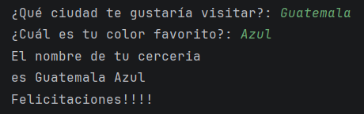

# 🍺 Generador Interactivo de Nombres para Cervecerías

Un script interactivo y ligero desarrollado en Python que combina entradas del usuario de forma creativa para sugerir un nombre único y personalizado para una marca o negocio de cervecería artesanal.

### Vista Previa de la Ejecución

## 📂 Archivo del Proyecto
Puedes visualizar el archivo `.py`

## 📌 Objetivo

Ofrecer un ejemplo práctico e introductorio sobre el manejo de entradas por consola, la manipulación de flujos de texto (strings) y la concatenación en Python, empaquetado en una utilidad divertida y creativa para sesiones de lluvia de ideas de branding o identidad comercial.
