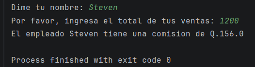

# 💰 Calculador de Comisiones de Ventas en Python

Script interactivo desarrollado en Python para automatizar el cálculo exacto de las comisiones mensuales o semanales del equipo de ventas, aplicando un porcentaje fijo sobre el total facturado.

### Vista Previa de la Ejecución

## 📂 Archivo del Proyecto
Puedes Visualizar el archivo `.py`.

## 📌 Objetivo

Proporcionar a administradores, contadores y supervisores de ventas una herramienta de consola rápida, ligera y eficiente para calcular los incentivos económicos del personal sin depender de hojas de cálculo externas, minimizando el margen de error en el pago de comisiones.
